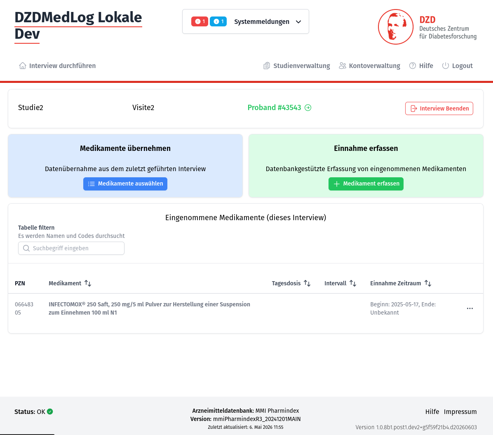

> [!WARNING]
> Beta phase product

# DZDMedLog

**DZDMedLog** is a web application for documenting the medication history of clinical study participants. Interviewers record which medications a proband is currently taking at each visit, building a structured medication timeline across the lifetime of a study.



The application is built by the [German Center for Diabetes Research (DZD)](https://www.dzd-ev.de) and released under the MIT license.

---

## Documentation

| Topic | Description |
|---|---|
| [Production Deployment](docs/production.md) | Run MedLog with Docker or from source |
| [Configuration Reference](docs/configuration.md) | All environment variables and settings |
| [Application Logic](docs/application-logic.md) | How Studies, Events, Interviews and Intakes work |
| [Permissions](PERMISSIONS.md) | User roles and study-level permission system |
| [Drug Database](docs/drug-database.md) | Drug data requirements, MMI Pharmindex, custom plugins |
| [Development Guide](docs/development.md) | Local setup, dev scripts, testing, branching |

---

## Quick Start

The fastest way to try MedLog is with the prebuild Docker image and demo mode:

```bash
docker run \
  -v ./database:/data/db \
  -p 8888:8888 \
  -e DEMO_MODE=true \
  dzdde/dzdmedlog
```

Then open **http://localhost:8888** and log in as `admin` / `adminadmin`.

> [!IMPORTANT]
> Demo mode is for evaluation only. It uses a random session secret and loads sample data. See [Production Deployment](docs/production.md) for a real setup.

---

## Drug Database

> [!IMPORTANT]
> MedLog requires a drug database to function in a clinical setting. **Licensed drug databases are not included** and must be supplied separately.
>
> A small built-in dummy dataset is available for demos and development.
>
> The primary supported database is the **MMI Pharmindex** (GKV Arzneimittelindex). See [Drug Database](docs/drug-database.md) for details on how to connect it and how to write a plugin for other databases.

---

## Tech Stack

| Layer | Technology |
|---|---|
| Backend | Python 3.14, FastAPI, SQLModel, SQLAlchemy (async), Alembic, Uvicorn |
| Frontend | Nuxt 3, Vue 3, TypeScript |
| Database | PostgreSQL (production) / SQLite (development) |
| Auth | Local users + OpenID Connect (OIDC) |
| Packaging | Docker (multi-stage build: Bun → Python) |

---

## License

This project is licensed under the **MIT License** — see the [LICENSE](LICENSE) file for details.
